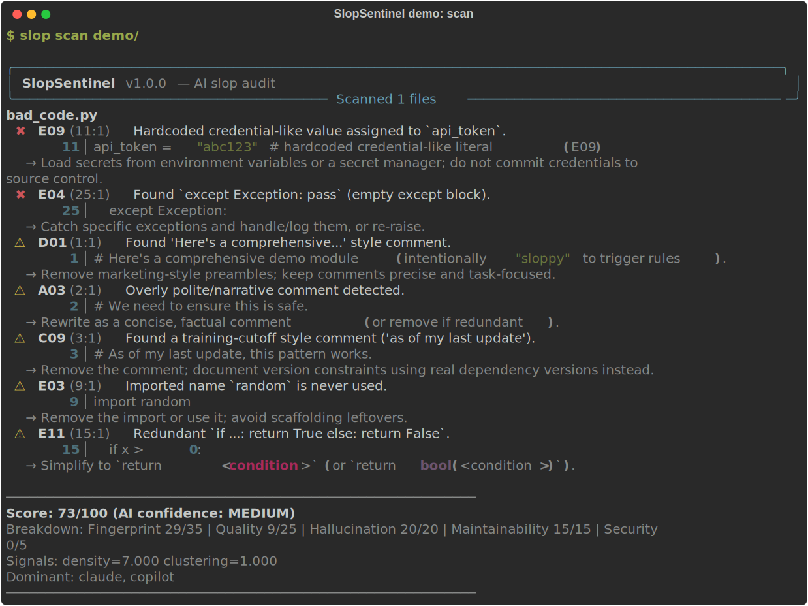
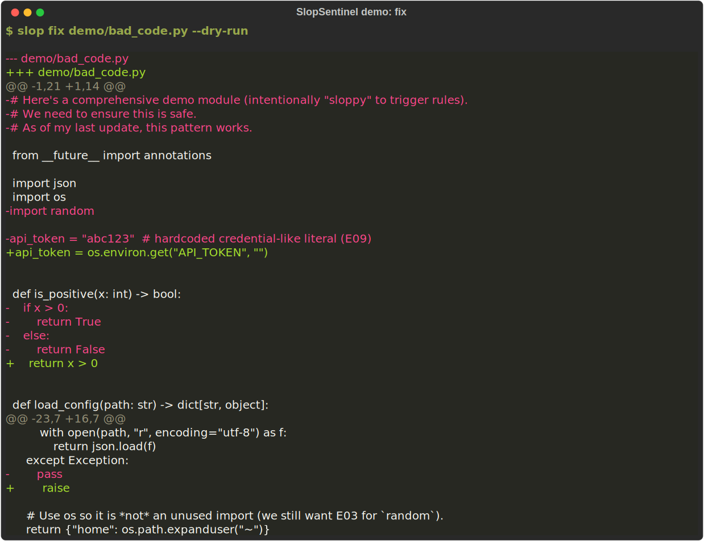
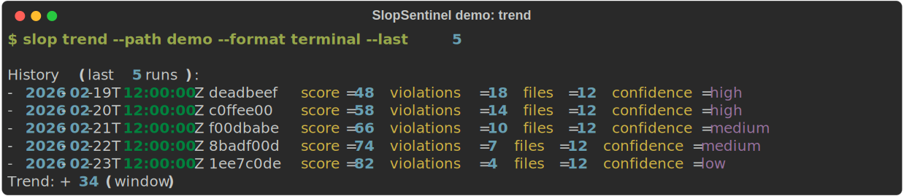

# SlopSentinel

Catch AI-generated slop before it ships.

[](https://pypi.org/project/slopsentinel/)
[](https://pypi.org/project/slopsentinel/)
[](https://github.com/slopsentinel/slopsentinel/actions/workflows/ci.yml)
[](https://github.com/slopsentinel/slopsentinel/actions/workflows/ci.yml)
[](LICENSE)
[](https://pre-commit.com/)

<p align="center">
  
</p>

SlopSentinel is a **local-first** auditor for AI-generated code patterns.
It scans your repo, reports findings with line-level context, computes a **0–100 score**, and can apply **conservative auto-fixes**.

It runs entirely on your machine/CI runner — **no network calls, no code upload**.

---

## Why SlopSentinel?

Traditional linters are great at correctness and style.
They’re not designed to catch the “AI-shaped” failure modes you see in real PRs:

- narrative / overly polite comments (“we need to ensure…”, “here’s a comprehensive…”)
- training-cutoff references (“as of my last update…”)
- unused scaffolding imports and cargo-cult patterns
- repeated literals and weak hygiene that erodes maintainability over time

SlopSentinel complements your existing tooling by focusing on **AI-specific signals** and **multi-language heuristics**.

| Feature | SlopSentinel | ruff | pylint | semgrep |
| --- | --- | --- | --- | --- |
| AI-specific patterns | ✅ | ❌ | ❌ | partial |
| Multi-language slop | ✅ | Python only | Python only | ✅ |
| AutoFix | ✅ | ✅ | ❌ | ❌ |
| Score / trend | ✅ | ❌ | ❌ | ❌ |
| GitHub Action | ✅ | ✅ | ❌ | ✅ |
| LSP | ✅ | ✅ | ✅ | ❌ |
| Baseline | ✅ | ❌ | ❌ | ❌ |

---

## Quickstart

```bash
pip install slopsentinel

# pretty terminal output (alias: `slopsentinel`)
slop scan .

# conservative auto-fix preview
slop fix . --dry-run
```

Want machine-readable output?

```bash
slop scan . --format json > slopsentinel.json
slop scan . --format sarif > slopsentinel.sarif
slop scan . --format html > slopsentinel.html
slop scan . --format markdown > slopsentinel.md
```

<details>
  <summary>More demos (autofix + trend)</summary>
  <p>
    
  </p>
  <p>
    
  </p>
</details>

---

## What it detects (rule highlights)

SlopSentinel ships built-in rules grouped by “fingerprint family” plus generic heuristics.
You can list the exact rules in your install:

```bash
slop rules
slop rules --format json
```

Highlights:

- **Claude (`Axx`)**
  - `A03`: overly polite / narrative comments
  - `A04`: trivial function with verbose docstring
  - `A06`: leaked `<thinking>` tags
  - `A10`: banner / separator comments
- **Cursor (`Bxx`)**
  - `B03`: console.log spray (TS/JS)
  - `B06`: empty TS interface/type shells
  - `B07`: overuse of `as any`
- **Copilot / GPT (`Cxx`)**
  - `C03`: hallucinated imports / dependencies
  - `C09`: “as of my last update…” comments
  - `C10`: `except Exception: pass` swallowing
- **Gemini (`Dxx`)**
  - `D01`: “here’s a comprehensive…” intro comments
  - `D04`: async without await
  - `D06`: exec/eval usage
- **Generic (`Exx`)**
  - `E03`: unused imports (conservative)
  - `E04`: empty/broad except blocks
  - `E06`: repeated string literals (extract constant)
  - `E09`: hardcoded credential-like literals (security)

For full details, see `docs/RULES.md`.

---

## GitHub Action

Example workflow (`.github/workflows/slopsentinel.yml`):

```yaml
name: SlopSentinel
on:
  pull_request:
    types: [opened, synchronize, reopened]

permissions:
  contents: read
  pull-requests: write
  security-events: write

jobs:
  audit:
    runs-on: ubuntu-latest
    steps:
      - uses: actions/checkout@v4
        with:
          fetch-depth: 0 # required to diff against the PR base commit
      - id: slopsentinel
        uses: slopsentinel/action@v1
        with:
          github-token: ${{ github.token }}
          threshold: 60
          comment: true
          fail-on-slop: false
          rules: "all"
          sarif: true
          sarif-path: slopsentinel.sarif
      - uses: github/codeql-action/upload-sarif@v3
        with:
          sarif_file: ${{ steps.slopsentinel.outputs.sarif_path }}
```

---

## Configuration

SlopSentinel reads `pyproject.toml`:

```toml
[tool.slopsentinel]
threshold = 60
fail-on-slop = false
languages = ["python", "typescript", "javascript", "go", "rust", "java", "kotlin", "ruby", "php"]
baseline = ".slopsentinel-baseline.json" # optional
plugins = []                             # optional: ["my_rules", "my_rules:export_rules"]

[tool.slopsentinel.rules]
enable = "all"
disable = []
severity_overrides = { "A03" = "warning", "C01" = "info" }
```

More:

- Rule reference: `docs/RULES.md`
- Scoring model: `docs/scoring.md`
- Architecture: `docs/ARCHITECTURE.md`
- Quickstart: `docs/quickstart.md`
- FAQ: `docs/faq.md`
- Plugin guide: `docs/plugin-guide.md`
- Case studies: `docs/case-studies.md`

---

## Editor integration (LSP)

SlopSentinel ships a minimal stdio LSP server:

```bash
slop lsp
```

It supports diagnostics, hover, and QuickFix code actions for conservative auto-fixes.
See `docs/ide-integration.md` for Neovim / VS Code / Emacs examples.

---

## Plugin system

You can load custom rules via `plugins = [...]` in `pyproject.toml`.
See `docs/plugin-guide.md` (examples + packaging) and `CONTRIBUTING.md` (export
mechanics + error handling).

---

## Contributing

See `CONTRIBUTING.md`.

---

## License

MIT — see `LICENSE`.
